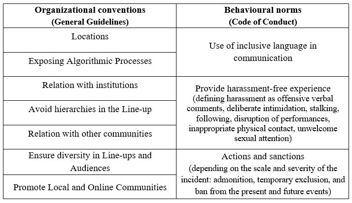

# Algorave

Since its emergence in the United Kingdom back in 2012, the term ‘Algorave’ has been used in several acceptations. Starting from a basic etymological dissection, the term derives from the _crasis_ of the English words’ ‘algorithm’ and ‘rave’. This portmanteau essentially suggests a connection with the so-called ‘Rave Culture’ (Anderson, 2009), while placing the emphasis on the distinctive involvement of algorithms in the musical performance.
As reported in several interviews (Cheshire, 2013; Dylan Wray, 2013; Nembhard, 2014; Sharp, 2020) by Alex McLean – one of the founders of Algorave, along with Nick Collins, Matthew Yee-King and Dan Stowell (McLean, 2019), it all started as a joke. While driving up to a gig in Nottingham with Collins, the radio was tuned to Rogue FM, a pirate radio station, where a set of happy hardcore music was been playing by DJ Jigsaw. That was the moment, adds McLean, when the idea to program rave music and this “kind of stupid word” (Sharp, 2020) came to their minds: “I think the term came up at that point. Another friend Dan [Stowell] picked up on it a couple of months later and the first algorave was born in a small London warehouse” (Nembhard, 2014).
In the ten years since, the Algorave phenomenon “has taken hold as a distributed network of thriving scenes, with events organised by experienced promoters finding large audiences in club and festival venues, or adopted by local musicians putting on parties in small rooms with big sound systems” (McLean, 2019: 175).
The first goal for this chapter is to delineate the predominant meanings associated with the term and to explore the emerging dimensions related to these, in order to come up with an operational definition that will be used in the dissertation (Sect. 1.1).
With this definition and its underlying dimensions in mind, it will be possible to move toward the theoretical framing of the Algorave phenomenon. In this sense, it is safe to begin arguing that, essentially, Algorave is about music. Accepting this clean statement as a starting point favours the opening of a discussion on the relational and collective aspects of making music together, here intended in a broader sense. Therefore, instead of limiting the focus on musical practices themselves, such as playing instruments or listening to music, the organizational elements that characterize music as a social activity will be included in the discourse (Sect. 1.2).
The chapter concludes by suggesting an understanding of Algorave as a distinct form of collective action (Sect. 1.3), discussing both the theoretical and empirical implications of this statement for the present study (Sect. 1.4).

## _Toward a definition_

As previously stated, the term ‘Algorave’ is polysemic in its character; a feature emerged during the last decade concurrently with its diffusion and uses across different social contexts.
This first section is devoted to the reconstruction of the various meanings related to the term, with the intent of providing a cohesive definition that will be used throughout the present dissertation. To this end, I will rely both on the self-definition provided by the main actors involved, accessed through their reference website,  and on the previous definitions found in early literature regarding this topic.

>“Algoraves embrace the alien sounds of raves from the past, and introduce alien, futuristic rhythms and beats made through strange, algorithm-aided processes. It’s up to the good people on the dancefloor to help the musicians make sense of this and do the real creative work in making a great party”.^[www.algorave.com/about/  (also quoted in Burland and McLean, 2016).]

Starting from these few declaratory lines it is possible to excerpt at least three early elements characterising the phenomenon: the link with ‘Rave Culture’ (Anderson, 2009; see also Thornton, 1994; 1996; Fritz, 1999; St John, 2004), the centrality of the algorithm and the understanding of the party experience as situated and co-created.
First, in this definition an explicit reference to raves and, more generally, to Rave Culture recurses. Algorave is posed in continuity with this dance music-related phenomenon of the recent past ^[Roughly a period lasted from the late 1980s to the early 2000s with fluctuating degrees of intensity before its commodification (Reynolds, 2013).] (Ruiz-del Olmo, Vertedor-Romero, and Alonso-Calero, 2019), which influences, according to this definition, are to be found in its ‘alien’ sound style.
Nevertheless, confining the ‘temporary autonomous zones’ (TAZ) experience, later simply referred to as ‘raves’, to a mere matter of music style would be reductive, to say the least. Before being absorbed by the “meta-experiential goods and services industry run by [...] peak-experience providers” (St John, 2004: 7), raves were “grassroots organized, anti-establishment and unlicensed all-night dance parties” (Anderson and Kavanaugh, 2007: 500).
Setting aside, at least for the moment, the conflictual essence emerging from the last part of the latter definition, it is important to stress the fact that raves were organized around communities, “largely for and by youth”, and represented “potent sites of _being together_” (St John, 2004: 7).
Algorave has been said to “revive” this culture “from research with live code programming for audio-visual creation by free software” (Ruiz-del Olmo et al., 2019: 425).^[For an in-depth comparison between ‘rave’ and ‘algorave’ see the work of Giovanni Mori (2020: 241-354).]
While the introduction of complex, or ‘futuristic’, beats and rhythmical patterns does not represent any sort of innovation for the music associated with Rave Culture per se,^[The introduction of such complexity has been possible to be observed throughout the evolution of the music styles associated with rave phenomenon since its second phase (early ‘90s), e.g., with the ‘bedroom rave’ or ‘intelligent techno’ (Reynolds 2013). Moreover, it has to be stressed that even the people involved in Algorave refuse to present themselves as innovators, as clearly stated in their website: “[t]his is no new idea, but Algoraves focus on humans making and dancing to music” (www.algorave.com/about)] an element in disjuncture from the past is the prominence of the algorithm in the music making and fruition processes.
As a premise, though, it should be pointed out that algorithmic music is not an exclusive feature of Algoraves either. Algorithmic approaches to composition and live generation of music have been experimented at least since the last decade of the 20^th century (Collins and McLean, 2014; see also Loy, 2007; McCormack and d’Inverno, 2012; Miranda, 2001). What actually distinguishes these previous adoptions of algorithm-based techniques in musical performance from Algorave, is the ‘distinctness’ of their use, as in the firsts “[a]lgorithmic music has been one component […] not made as explicit as at algoraves” (Collins and McLean, 2013: 355). The distinctive explicitness lies in a particular practice, namely ‘live coding’, to which Algorave is strictly tied, to the extent that it has also been considered as “an important subset” of this practice (Haworth, 2018: 573).
Live coding can be defined as the _practice of real-time programming and manipulating source code, creating and modifying algorithms with the final intent of music and visuals production_.
During the performance of this technique in public, the screen of the live coder is projected on stage, thus revealing – and making explicit – the code and the manipulative operations performed on it. Behind this practice, it is present an effervescent global community, called TOPLAP – an acronym for Transdimensional Organisation for the Proliferation of Live Art Programming^[For general information regarding their activity, see the website (https://toplap.org last accessed 15/05/2022).] – active in the field of performative arts since 2004, articulated in several local nodes around the world.
The study of this practice can count on several contributions provided by a cohesive group of scholars,^[See for instance ICLC ­ International Conference on Live Coding, the academic component of TOPLAP community (https://iclc.toplap.org/ last accessed 15/05/2022)] that are often themselves involved in the process as performing actors (Armitage, 2018; Blackwell, Cox, and Lee, 2016; Brown, 2018; Burland and McLean, 2016; Collins and McLean, 2014; Di Prospero, 2013; Lee, 2019; Magnusson, 2014; McLean, 2019; Mori, 2020; Nilson, 2007; Salazar and Armitage, 2018; Villaseñor-Ramírez and Paz-Ortiz, 2020).
Bearing further witness to the indissoluble bond between the phenomenon and live coding practice, the term Algorave has been also said to have emerged and used “as a descriptor of genre [for] music made through live coding” (Armitage, 2018: 32).
Hence, live coding can be considered “what ties together” (McLean, 2019: 175) a multi-faceted phenomenon like Algorave, evidencing the presence of a _practical_ dimension deemed necessary to be accounted for in the definition process.
Just as commonly as being tied to the live coding practice, Algoraves are intended as social events (e.g., Di Prospero, 2013; Collins and McLean, 2014; Armitage, 2018; Ruiz-del Olmo et al., 2019).
In this sense, the term Algorave is apt to signify the lieu where the creative process of live music and visual production – and its presentation to an audience – takes place (Ruiz- del Olmo et al., 2019). Indeed, contextually to its use for illustrating the live coded performance itself, “[t]he term […] came into use to describe events where people gather together to watch and perform live coding” (Armitage, 2018: 32).
Algoraves are thus understood as social occasions where people previously involved in – or just interested or curious about – the practice of live coding have the chance to meet and recognize among each other. Moreover, for those already engaged in activities related to live coding, Algoraves offers “participatory meeting spaces” (Ruiz-del Olmo et al., 2019: 438) to share and improve specific knowledge about this practice.
Taking a step back to the last part of the self-definition presented at the beginning of this paragraph, a crucial characteristic of this kind of event comes forth – namely the acknowledge of the Algorave experience as situated and co-created.
Differently to other kinds of musical performance, one could think for instance of a classical music concert or a more or less famed rockstars’ show, the active participation of the public – _‘the good people on the dancefloor’_ – in the event is considered fundamental. Not so much because of their interactive involvement with the performance, as could be exemplified by handclapping following the rhythm – either of Johann Strauss’ Radetzky March at the Vienna Philharmonic’s _Neujahrskonzert_ or of the four-on-the-floor intro of possibly any rock song, but rather because of the audience active participation in the semiotic processes occurring on an Algorave event. The audience members are expressly called to _‘help the musicians make sense of [the performance] and do the real creative work in making a great party’_.
Thus, it is important to bear in mind that considering Algorave as an event, as “a current _locus of activity_ where algorithms are explored in alliance with live electronic dance music” (Collins and McLean, 2014: 355, emphasis added), implies the presence of underlying semiotic processes and that the performers are not alone in this meaning exploration.
Besides, from a micro-sociological perspective, defining Algorave in terms of event allows to intend it as a ‘social situation’ (Goffman, 1986; see also Abbott, 2001; Norton, 2014), meant as the “temporal and spatial conjuncture of circumstances experienced by an actor at a given moment” (Norton, 2014: 163). Therefore, for the present definitional purpose, the second aspect of the Algorave phenomenon emerging is the existence of a _situational_ dimension of the concept.
Understanding Algorave as an event lets emerge an additional dimension that, even if strictly tied to the previous one, should be still considered distinguished from it.
As the Algorave events are not exclusively characterized by the presence of a live coding  performance,^[Despite, as previously stated, the term came into use in order to describe events where live coding performance take place, it is rather important to stress the fact that not all the live coding events have been referred to as ‘Algoraves’.] a central question to be asked is what distinguishes these from other music-related events – especially from those involving live coding. An initial answer can be retrieved from the definition of Algorave as a ‘format’ (Collins and McLean, 2014; Haworth, 2018).

>“The format of an algorave is not clearly defined, and what goes on is ultimately the choice of the artists involved on the night, and audience members who choose to attend. Nonetheless, certain features of the archetypal algorave are explicit: algorithms, music and dancing should be involved”
>(Collins and McLean, 2014: 355)

Similarly to raves, an important component for an Algorave is dancing. At least in the intention,^[As McLean (2019: 175) himself reported, mass dancing was ‘rare’, particularly at the first Algoraves.] this represents an element of differentiation with other kinds of live coding events, often more devoted to research on and experimentation with music than providing a danceable musical experience for people on the dancefloor.
Nevertheless, while this co-constructive relationship between performers and audience members reinforce the idea of Algorave as situational, the features presented seem to be too generic to constitute precise boundaries to define the format of an Algorave.
One of the main reasons behind this unclarity regarding the format relies on the fact that Algorave, as a ‘brand’, is not a registered trademark (Collins and McLean, 2014; McLean, 2019). Indeed, “[u]nlike creative franchises such as MakerFaire and TED, the algorave brand is purposefully unprotected: anyone is free to host one and there are few constraints” (McLean, 2019: 175).
As a matter of fact, the organization of new Algorave events are more welcomed than simply allowed,^[This can also find evidence by the disclaimer “Want to run your own algorave?” right at the top of  the website homepage (www.algorave.com), and the first point of the Algorave General Guidelines which states: “[f]irst and foremost: by all means, please go ahead and host/promote an Algorave! And have fun” (see Appendix A).] and it does not need to fulfil particular rules imposed from above, as “any central control is limited to informal negotiation” (Collins and McLean, 2014: 355).
If on one side this might complicate any attempt of defining the boundaries for the phenomenon, on the other the freedom granted with regard to the organization of this kind of event represents an interesting feature because of its inherent variety of possible interpretations, receptions and realizations occurred over the years.
Despite the absence of a rigid set of rules, ‘few constraints’ (McLean, 2019), _conventions_ and _norms_ rather than rules, still exist for the organization of and the attendance to an Algorave event, denoting a _normative_ dimension associated with the concept.^[Please note that I refer both to conventions and norms in my use of the term ‘normative’, even if these are of course distinct – as norms are conventions “backed with sanctions” (Crossley, 2020: 35).]
These conventions and norms are collected in two main documents, retrievable from the Algorave website: the ‘Algorave General Guidelines’ and the ‘Code of Conduct’.^[A full transcript of the two documents are reported in Appendix A.] The documents are concerned, respectively, with how to organize – _organizational conventions_ – and how to behave at – _behavioural norms_ – an Algorave event. A brief summary of these are presented in the following table (Tab. 1).

Most of these organizational conventions are suggested as orientations. Taking as an example the part regarding the possible location for an Algorave event, in the Guidelines it is stated: _“[y]ou can’t go wrong with full range speakers and high contrast ratio projector in a small, dark room, preferably with fog/haze. If you want to do a concert with rows of seats that’s fine but best not call it an Algorave”_. Through the use of a straightforward language, not without a hint of irony ( _‘preferably with fog/haze’_ ), another distinction between Algoraves and other kinds of musical events – also those involving live coding – is made.
Giovanni Mori (2020), in his ethnographic work on live coding, describes the location of Algoraves events as follows: “[these] are mainly characterised by club-style settings, even though they are not particularly curated from the aesthetical point of view and very occasionally organised in the same places in which raves usually are. [They recall] the DIY and improvised settings that have very often characterised rave parties since the early examples of the late 1980s” (Mori, 2020: 241-2).
Moreover, with regards to the relationship with institutions, in the Guidelines a suggestion to _‘be wary’_ is present: bearing in mind that Algorave is _‘free culture’_, any _‘sponsorship or institutional alignment’_ should be taken carefully – but not a priori refused.
Other possible distinctive features are represented by the expressed references to diversity, both in line-ups and audiences, as well as to the refusal of hierarchy among the performers. While the first reference underlies a particular attention for inclusiveness and against any kind of discrimination, the second witnesses a clear opposition to an archetype of _‘unequal’_ performance or show. This last is exemplified, for instance, by performances centred more on _‘headliner’_ DJs’ or producers’ names and fame rather than on their music, to which Algorave, taking inspiration from the rave experience, counterpose _“the spirit of semi-anonymous people playing to unified crowds”_ (‘Collapsing hierarchies’ – General Guidelines) and a specific focus on “the music, and people dancing to it”.^[“Algorave musicians don’t pretend their software is being creative, they take responsibility for the music they make, shaping it using whatever means they have. More importantly the focus is not on what the musician is doing, but on the music, and people dancing to it” (www.algorave.com/about). This is also tied to the use of software – and technology in general – during the performances. While other electronic-music performers are said to ‘hide’ what is going on during their performance, in Algorave, as well in live coding events, the ‘transparency’ of the performance is a cornerstone, as it is evident by the habit of projecting the computer screen on the stage (see also the point ‘Exposing Algorithmic Processes’ of the General Guidelines).]
In the same vein, in a previous point of the Guidelines, it is suggested to avoid excessive _‘self-promotion’_, although having a twofold role of promoter and performer is generally accepted.
This sort of unpretentiousness – namely avoiding individualism and to act like a star – is also emerging in the point regarding the relationship with other communities. This relation has to be based on _‘respect’_, insofar as Algorave has not to be considered the next big thing in dance music.^[The statement ‘Algorave is not the future of dance music’ in the Guidelines refers to an online article appeared on the website of the British newspaper ‘The Guardian’ in 2017, entitled “Run the code: is algorave the future of dance music?” (Amrani, 2017). This article had quite a cold reception in the community, as it is possible to evince from several – mostly mocking – Facebook posts on the Algorave page (@algoravers): “Is future the music of algorave dance?” (posted on 30/11/2017), “Algorave is not the future of dance music” (01/12/2017), and “Announcement: ALGORAVE IS ELECTRONIC MUSIC RIGHT NOW. After many subeditors predicted us as as the future of electronic music, we’re finally happy to reveal that we are actually electronic music at this very moment. (for the next five minutes only)” (18/04/2018).] Rather it should be intended as an experiment, carried out over the years by an active group of communities, both local and online, _‘lifting each other up’_ through Algorave events.
This leads us to the final dimension of the concept, namely its _collective_ essence.^[In this sense, Algorave has been also referred to as a “movement” (McLean, 2019: 175).]
The Algorave phenomenon is built around a collectivity, formed, event after event, by a variety of actors belonging to local – and online – communities around the world. A “distributed network of thriving scenes” (McLean, 2019: 175) tied one another by mean of the relationships occurring among the main actors involved and the shared orientations toward musical experience – here intended in a sense sufficiently broad to include the organization and participation to music events, besides the way of making and enjoying music. In this sense, the norms and conventions discussed earlier are ‘ _community-sourced_ guidelines for taking part’ (General Guidelines, emphasis added) to this peculiar experience.
The Algorave community and the associated collective aspect will be further discussed in the next section of this chapter.
Prior to that, in order to conclude this part, a definition apt to synthetize the four dimensions emerged – _practical_, _situational_, _normative_, and _collective_ – is presented. Rather than as an ontological stance, this definition should be intended as a starting point for tasting the complexity of the social phenomenon here investigated.

Thus, I will thenceforth refer to the term ‘Algorave’ as _a locus of human musicking (inter)action in synergy with algorithm, articulated in a network of normed social events, individual actors and communities_.

## _An Algorave world?_

In order to frame theoretically the phenomenon here investigated, it is safe to start by arguing that, essentially, Algorave is about music.
Above all the possible definitions,^[It is worth to remind that an entire subfield of sociological research, namely ‘sociology of music’, has been devoted to the study of this concept, since the contributions on the topic by classical sociologists including Georg Simmel (2015 [1882]) and Max Weber (2015 [1920]), and any attempt to provide a comprehensive review would invetibaly risk to be limited, if not inconclusive.] music has been interpreted as a “meaningful context […] not bound[ed] to a conceptual scheme, [in which] social relationships of highly complicated structures [prevail]” (Schütz, 1951: 76).
According to Alfred Schütz (1951), instead of focusing on the “phenomenology of musical experience” per se, the “investigation of the social relationships among the participants in the musical process” represents an important “prerequisite for any research in this field” (Schütz, 1951: 76).
This approach, inherently _relational_, is based on the implicit assumption that any reification of music has to be refused, rather favouring its understanding as an activity.^[ For further elaboration, see Becker (2008 [1982], 2-6).]
It is on this wise that Christopher Small (1998) popularized the concept of ‘musicking’, addressing music as an actual verb – ‘to music’. In the author’s thought, overestimating the significance of ‘music objects’ – or ‘works’ – is failing to investigate music “as it is actually practiced throughout the human race” (Small, 1998: 7), particularly in considering these as unique carriers of musical meaning:

>“The fundamental nature and meaning of music lie not in objects, not in musical works at all, but in action, in what people do. It is only by understanding what people do as they take part in a musical act that we can hope to understand its nature and the function it fulfills in human life” 
>(Small, 1998: 8)

Even if the present study is oriented towards more modest purposes, one important point to be stressed is the attention drawn to the _action_ of the actors involved in the musical process.
The participation of individuals to ‘musical acts’ can be articulated in a set of actions, that eventually results in the ‘musicking’ activity: “whether by performing, by listening, by rehearsing or practicing, by providing material for performance (what is called composing), or by dancing” the involved actors “take part […] in [the] musical performance” (Small, 1998: 9).
Extending the meaning of the ‘musicking’ concept, continues Small, other actions can be envisaged in addition to those mentioned above. Thus, besides focusing exclusively on the performance of music and its reception, one may consider for instance all the activities related to ensuring the proper execution of the performance itself. From setting up the instruments and sound check, to ticket selling at the entrance, all the actors involved in these activities – elsewhere referred to as ‘support personnel’ (Becker, 1974; 1982) – are said to “contribut[e] to the nature of the event that is a musical performance” (Small, 1998: 9).
To recall the set of musicking-oriented actions that the individual actors might perform, though, should not make lose sight of the fundamental fact that these are seldom^[Consider the case of a person playing by him or herself, just for his or her own delight. Could it be considered as a social interaction? The answer depends on how ‘social interactions’ are understood – whether as strictly deeming immediacy and co-presence or not. Stretching enough the definition, as in the latter case, could result in an affirmative answer. For further elaboration see Crossley (2020, 21-23).] taking place outside the social domain, and are thus mostly to be intended in terms of _interactions_.
Indeed, it is precisely considering its social nature that music has been defined as a specific form of social interaction (Becker 1974; 1982; Small, 1998; Turino, 2008; Crossley, 2015; 2020).
Instead of thinking about music as reified ‘in’ society, in order to frame it within a relational perspective it should rather be conceived as an activity _“of society”_, as “a form of social interaction embedded in the wider network of social interactions that comprise society, and it both shapes and is shaped by the dynamics of that network” (Crossley, 2020: 9).
In other words, as social interaction, music “is both embedded within and generative of social structure” (Crossley & Ozturk, 2019: 193), the investigation of which is central to broad sociological interest.
In order to deepen the main implications of the previous statements and to provide a distinct approach to address them, the ‘art worlds’ conceptualization by Howard S. Becker (1982) is proven useful.
Focusing on the collaborative dimension behind art activities,^[Among which music is not only present but results to be a remarkable instance, particularly considering Becker’s personal experience as a jazz musician (Becker, 2000; 2004; Faulkner and Becker, 2009).] this approach has been said to “[offer] a sociologically satisfactory means of explaining cultural patterns” (Martin, 2006: 96) in music, as also substantiated by its wide adoption in literature related to this topic (among all, see Gilmore, 1987; 1988; Finnegan, 1989; Martin, 2005; and more recently Crossley, 2015).

>“Art worlds consist of all the people whose activities are necessary to the production of the characteristic works which that world […] define[s] as art. Members of art worlds coordinate the activities by which work is produced by referring to a body of conventional understandings embodied in common practice and in frequently used artifacts. The same people often cooperate repeatedly, even routinely, in similar ways to produce similar works, so that we can think of an art world as an established network of cooperative links among participants.”
>(Becker, 2008 [1982]: 34-5)

From this definition, it is possible to evince a crucial understanding for the concept of ‘art world’: namely, that this can be intended as a cooperative _network_^[The term ‘world’ itself is declared to be used by the author to “denote the network of people whose cooperative activity, organized via their joint knowledge of conventional means of doing things, produces the kind of art works that art world is noted for” (Becker, 2008 [1982]: xxiv). The use of this term by the author is a clear reference to the “social world perspective” (Strauss, 1978; see also Shibutani, 1955), elaborated within the Chicago-led symbolic interactionist tradition to which he belongs.] formed by the actors involved in the art work production.
As noted by Nick Crossley (2015), whose theoretical work has at its foundation the ‘art world’ approach, Becker uses the term ‘network’ in a twofold sense. On one side, the word is apt to illustrate the ‘division of labour’ necessary for the production of the art object. The set of actors, each endowed of a role – whether performer, listener, or support personnel, who are involved, for instance, in a musical performance, are tied and form a cooperative network aimed at its proper execution and _ex post_ re-elaboration. In this sense, it could be argued that the art work oriented toward the object production contextually creates a network (Ibidem).
In a second sense, from a broader perspective, the term is used to “capture the web of interacting social actors involved in a world and the ‘community’ they form” (Crossley, 2015: 36).
Regardless of their role, the actors involved relates one another by sustained interactions occurring in time – _‘repeatedly’_ if not _‘routinely’_ – in social situations where shared meanings and conventions are developed. As a result of this process, ties among actors are generated or strengthen, if already present, and the resulting network, the ‘world’, is formed.
In this sense, the world as a network is “a ‘space’, social and physical, of interaction and of the shared meanings, symbols, definitions, objects and practices generated, across time, by such interaction” (Crossley, 2015: 29).
In his study about the emergence of punk and post-punk worlds in England, Crossley (2015) further elaborates Becker’s theorization, specifically addressing musical activity, introducing the concept of ‘music worlds’.^[Considering the interactions centred upon music – as formation of bands, recordings and their distribution, as well as live performances and their organization – occurring in a five years’ timeframe – 1975-1980 – in three UK cities – London, Manchester, and Sheffield, Crossley reconstructs the sets of relationships among the main actors involved in early ‘punk’ world and its evolutive trajectory, up to its convergence in the so-called ‘post-punk’ world. Crossley developed his conceptualization of ‘music worlds’ through a number of publications over the years (Crossley 2008; 2009; 2015; 2015a,b; 2020; Crossley and Bottero 2014, 2015; Crossley and Emms 2016; Crossley, McAndrews, and Widdop, 2015; Bottero and Crossley 2011; Emms and Crossley 2018; Hield and Crossley 2015).  For the present discussion I will mainly refer to the latest version proposed of his theorization (Crossley, 2020), only occasionally referring to his other contributions.] This concept, explains the author, is “intended to aid the identification and analysis of interesting clusters of musical interactivity within the wider network of musicking of a given society (the musical universe)” (Crossley, 2020: 72).
Generally,^[With the exception of the ‘mainstream’ (see Crossley, 2020: 63-68).] ‘music worlds’ are based on at least one of these elements: a _locality_, a _music style_ – as well as an aesthetic and internal goods associated with it, and an _organisational and/or political ethos_ (Ibidem, 73). To these, the author combines five ‘structuring factors’ – namely, narratives, identities, conventions, resources, and focal time-spaces (Ibidem, 74).
In the remainder of the present section follows a discussion aimed at framing Algorave in the light of what has been stated so far, questioning, in particular, the possibility to intend it as a ‘music world.’
Firstly, music worlds are said to may be characterized by a locality. In the introduction of their book on ‘music scenes,’ Andy Bennett and Richard Peterson (2004) distinguish three ‘general types’ of scenes: local, translocal, and virtual.^[“[C]lustered around a specific geographic focus, [...] a local scene [is] a focused social activity that takes place in a delimited space and over a specific span of time in which clusters of producers, musicians, and fans realize their common musical taste, collectively distinguishing themselves from others by using music and cultural signs often appropriated from other places, but recombined and developed in ways that come to represent the local scene. [...] Often the most self-conscious local music scenes that focus on a particular kind of music are in regular contact with similar local scenes in distant places. They interact with each other through the exchange of recordings, bands, fans, and fanzines. These we call translocal scenes because, while they are local, they are also connected with groups of kindred spirits many miles away. [...] [T]he virtual scene involves direct Net-mediated person-to-person communication between fans, and the scene is therefore much more nearly in the control of fans. This may involve, for example, the creation of chat rooms or listservs
dedicated to the scene and the trading of music and images online” (Bennett and Peterson, 2004: 8-11).] Despite one could assume that “the local, trans-local and virtual dimensions of a world are potentially intersecting sets” (Crossley, 2020: 73), it would still be difficult to narrow Algorave to this framework. Indeed, one important point to be made is that this approach seems more appropriate to the study of a cluster of interactivity at a certain point in time, or at best over a limited span of time, and does not actually allow to grasp the evolutionary dynamics underlying it.^[This is not the case of Crossley’s (2020) use of the term ‘locality’ for music worlds, that on the contrary is based upon the idea of a “structure-in-process” (Ibidem, 73).] Even if the first Algorave event has been organized in London, to associate the phenomenon to a local scene seems to be ineffective, particularly if one consider the events that followed – organized in other cities around UK at first, and in other four countries all over the world in the first year only.
Moreover, the conceptualization of ‘virtual’ scene, as suggested by Bennett and Peterson (2004), results inevitably outdated. Nowadays, it would be quite troublesome to identify scenes that does _not_ have an online presence at all. Algorave, furthermore, represents a peculiar case in this sense, as a fair share of the activities associated with it has a virtual dimension or it is even exclusively taking place online.^[These are respectively the cases of live concerts, organized in a physical space and in co-presence, where one or more performances are live streamed, and of the Algorave events that has been held entirely on the internet.] In addition to this, of course one should not forget the regular communications regarding the topic via specialized chats and forums, in which the clusters of involved actors can ‘realize their common musical taste’, ‘collectively distinguish themselves’ and ‘recombine and develop’ music and cultural signs as well.^[See note 29] Eventually, as will be noted shortly, despite its global and virtual aspects, local expressions of Algorave emerged over the years, pointing to a complex structure articulated on each of the three dimensions proposed and not reducible to one of these.
A crucial point to be further stressed with this regard is the significance of the ‘focal time-spaces’ structuring factor, insofar “[i]f music is social interaction […] then its participants must enjoy the opportunity to connect” (Crossley, 2020: 77). Leaving aside for a moment its virtual dimension, Algorave has been previously defined as also constituted by social events. On this wise, Algorave events represent opportunities for the people involved to “converge in particular places at particular times,” thus facilitating both interaction and, in Durkheim’s (1915) terms, the _collective effervescence_ necessary to a world to be formed (Crossley, 2020: 7; see also Crossley, 2015: 87-9). From this point of view, it is important to bear in mind the significance of _where_ and _when_ the events constituting Algorave have been taken place, especially in any attempt of reconstructing the evolutionary trajectory of the phenomenon. Thus, in order to account for the variety of possible interpretations, receptions, and realizations occurred over the years,^[Indeed, as also reported by McLean, “these events have each developed their own local flavour, having taken place in dozens of cities across Europe, Australia, Japan, and both North and South America” (McLean, 2019:175).] already mentioned when discussing the leeway in the Algorave events’ organization, particular attention has to be paid both to the place and the point in time each event has taken place.
The second key feature upon which music worlds are said to be centred upon is a ‘music style’, complemented by aesthetic and internal goods. Strictly speaking, Algorave is not characterised by neither a unique nor a cohesive music ‘style’. Indeed, at an Algorave event one could find rhythmical and danceable music, as well as ‘chill-out’ rooms where more slow-paced experimental music is played. Still, as also emerged along the previous section, certain recurrent elements exists, distinguishing Algorave from other forms of musicking.
One further step to be made is to discuss other possible distinctive elements in view of the structuring factors of ‘conventions’ and ‘resources’.
As suggested by Ruth Finnegan (1989), a world’s constitutive conventions may represent an element of distinction from other worlds. These conventions regard the learning process of musicians, how they intend and value the composition and performance activities, the role of improvisation, and how to organise and behave at a performance (Finnegan, 1989, in Crossley, 2020). While the latter have been already discussed earlier in the chapter, and _do_ represent elements of distinction for Algorave, the firsts do not seem to prove the same. Indeed, no specific conventions about learning, composition or improvisation are strictly associated to Algorave per se. These do associate with the practice of live coding, though, re-opening the unfulfilled question about what distinguish Algorave from this practice.
As made of a set of specific techniques, live coding involves, and is based on, these constitutive conventions, insofar as a ‘live coder’ – the live coding musician – has to learn and improve his or her composition, regardless the kind of performance (s)he wants to achieve.^[A case in point is the role of improvisation, insofar as live coding is a practice mainly based upon it (e.g., Mori, 2020). For an in-depth analysis of the relation between conventions and improvisation please refer to the work of Becker and Faulkner (2009; see also Becker, 2000).]
A similar argument emerges regarding resources. Algorave involves the use of “specific resources,” as “esoteric skills, unusual instruments or technologies” (Crossley, 2020: 76), inasmuch as these are proper of live coding. Programming, for instance, could be understand as an ‘esoteric skill’ – in the sense that it does not belong to the set of techniques usually associated with musicking, specifically in its live performance use – but this is a core aspect of live coding, rather than Algorave in itself. Subsequently, how technology is _used_ by live coders differentiates both Algorave and live coding by others kind of musicking. In other words, is not the use of computer per se – as a large number of musical performances nowadays involves it – but how this technology is used to create a unique kind of performance – e.g., projecting the code to the stage – and for the development of ‘unusual instruments’, namely the software and programming environments used for this practice.^[Despite Algorave has been expressely said to “provide a fertile alternative concert and club scene for the live development, deployment and testing of novel musical interfaces” (Collins and McLean, 2014: 357), it is also true that other experiences related to live coding – e.g., workshops dedicated to this practice – may provide similar opportunities in this sense.]
Furthermore, both in live coding and Algorave the “level of resourcing” involved could be minimal,^[Similarly to folk-singing local worlds (see Hield and Crossley, 2015).] and the “source of funding” (Ibidem) for the organization of events can be retrieved quite differently from event to event, from crowdfunding initiatives to institutional support.
Eventually, with regards to organizational and political ethos, for the time being is deemed to be enough pointing at the similarities and overlap among declarations of intents present in the cultural production of both Algorave and the umbrella community for live coding practitioners, the already mentioned TOPLAP ^[The outcomes of this cultural work are mainly retrievable by associated forums and chats, as well as interviews by media to the key actors – often overlapping these two collective formations. For TOPLAP see in particular its manifesto, available at: https://toplap.org/wiki/ManifestoDraft (last accessed 15/05/2022). For a discussion about the evolution of the present draft manifesto, please refer to the work of Haworth (2018).]  – one on all, the value associated to free culture and software.
From what emerged so far, it could be stated that if a ‘world’ related to Algorave exists, this is associated more to the general organization around live coding than to the phenomenon in itself. Thus, considering the presence of a global, and virtual, community centred upon the practice of live coding – namely, TOPLAP – and the outcomes of the above discussion regarding the key aspects of music worlds – as said, mostly associated with the organization around this practice in general – I suggest the existence of a _‘live coding world’_. Thereafter, I refer to this expression in order to denote the cluster of musical interactivity, and the underlying array of social relationships that constitutes it, characterized by the use of this set of techniques in the musicking activity.
As a consequence, accepting this perspective is to implicitly suggest the presence of a pre-existing network upon which Algorave phenomenon relies in its development. This idea needs to be unpacked.
The first step in this direction is to briefly define the social structure underlying the live coding world. TOPLAP represents the principal component of this network: a main translocal formation aimed at _bonding_ and _bridging_, both virtually and physically, the various situated groups – “nodes” – centred upon live coding practice. In this sense, the live coding world is a network formed by local communities that, considering the constitutive centrality of this practice for them, can be understood as proper “communities of practice” (Lave and Wenger, 1991; Wenger, 1998), collective formations built around the interest, learning, adaptation and replication of a certain practice through regularly based interaction. Moreover, if the virtual dimension of these local communities is contemplated, focusing on the discourse – and narratives^[Here specifically intended in their acceptation as a structuring factor for music worlds (see Crossley, 2020: 74).]  –  elaborated via chat and forums, these may also be considered as “interpretive communities” (Fish, 1980).
The roles associated to each of the actors involved in these communities are blurring, as performers are also active audience members – and possibly part of support personnel at events – and all are contributing to this interpretive process, despite their role. Who enters the community is significantly encouraged to join more and more actively, for instance through moral support in the first performing attempts or patiently providing technical help with software issues.^[I retrieved both these example from my personal experience as a ‘live coder’, so to say. Despite, in general, I would affirm that this kind of conventioned openness has quite an impact on ‘accessing’ this world, this does not come as straightful as it may seem (e.g., considering gender issues, see Cohen, 1991; 1997; for the specific case of live coding see Armitage, 2018).]
Nevertheless, as earlier pointed out, Algorave does not seem to be directly associable with the sustained activity of one particular local community, but rather emerging from few individuals involved in possibly more than a single community – even if all geographically located in UK, considering the locations of the first events.
Turning to literature related to the study of “social movements”, I argue, can provide further insights to the present conceptualization effort.
In one of his most influential paper, Luther Gerlach (1971) suggests a categorization of structural characteristics denoting social movements’ organization. Despite the case studies^[Namely black power, participatory ecology, and the charismatic renewal movements, even if also “the new left, women’s lib, the counterculture, the Viet Cong, Palestinian liberation” are said to having all “stimulated discussions about aspects of their structure” (Gerlach, 1971: 812).] he analysed had little to do with music and, in comparison with Algorave and live coding, seems to belong to a distant past, some of his suggestions result still helpful to the present study.
The author derives three main aspects of movement organization, which are its being ‘segmentary,’ ‘polycephalous’, and ‘reclutative’ (Ibidem). In the first sense, movements are said to be consisting of a range of different groups, or “cells”, which may “grow and die, divide and fuse, proliferate and contract” (Ibidem, 818). In his view, a process of  exponential proliferation of these ‘cells’ happens from a previously existing core. These groups can be “rang[ed] […] along a continuum of conservative to radical according to means and goals, or according to degree of institutionalization” (Ibidem).
Moreover, generally, no central command or decision-making structure is present, as the power and authority are distributed among members, while leadership is mainly based on charism rather than bureaucracy. This should not be intended as an absence of leadership at all – ‘acephalous’ condition – but rather as a ‘polycephalous’ structure, where multiple members can occasionally play leading roles (Ibidem, 818; 820-22).
Eventually, it is important to stress that “the decentralized, segmentary, organizational structure of a movement owes its cohesion to linkages among autonomous cells” (Ibidem, 822) and thus that groups are organized in a broader network.
Under this light, live coding world resembles more than a single aspect associated to the movements studied by Gerlach. Both the two formations are seen as a network of cells, or communities, characterized by the absence of a unique leading actor, being rather guided by influential figures belonging to each small group.^[For the case of music worlds, Crossley (2015) suggests the presence of key actors, e.g., “pioneers”, in the punk and post-punk worlds. See also Crossley, 2009.]
One critical point for a deeper comprehension of Algorave, though, is the fact that ‘cells’ as defined by Gerlach are _not_ strictly limited geographically. Moreover, rather than on where they are located, their constitution depends more on particular understandings of, for instance, a certain activity of the movement. Albeit generally oriented toward a more or less defined objective common to the movement they belong, even their ‘means and goals’ may differ from other groups of the same formation. On the basis of these different interpretations, and consequent related actions I would add, cells can be hence conceptually positioned in the radical-conservative continuum mentioned above.
From this perspective, the Algorave collectivity can be intended as a cell based on a particular interpretation and, above all, on a particular exercise of the live coding practice in specific normed social events. Even if the radical-conservative extremities may not be straightforwardly applied,^[Before, one should prove the existence of an established live coding ‘original’ practice to which more recent expressions refer, thus being possibly denoted as either in line with – conservatives – or deviant from it – radical.] what is important to stress here is that, as emerged also over the previous section, certain elements distinguishes Algorave, and one of this, I argue, is the interpretation and consequent exercise of the live coding practice.
Thus, the Algorave collectivity generates from the pre-existing network of the live coding world, forming as a cell, ‘event after event’, as previously stated.
In this sense, more than a ‘local community’ or a ‘community of practice’ then, it may be argued that Algorave collectivity resembles a ‘protest community’, a concept again borrowed from literature on social movement and, in particular, from the work of Mario Diani (2009). Indeed, similarly to what happens in this kind of communities,^[Where “the social bonds, the identities and skills and the shared world-views” – that are usually said to develop within associations – “may also originate from sustained involvement in [...] protest settings” (Diani, 2009: 66).] the ‘main unifying element’ for Algorave community is their “recurrent participation” at – and, I would add, organization of – Algorave events, where a “distinct sense of commonality and specific bonds between people who repeatedly share the same experiences” (Ibidem, 66) are originated.
If its collective dimension has been mostly disentangled in this section, the main question regarding how to intend ‘Algorave’ remains open. My final suggestion is to understand it as a specific form of collective action.

## _Algorave as collective action_

From a theoretical standpoint, one of the key elements emerged from the discussion carried on so far is that music, similarly to other forms of art, underlies thick webs of social actors, tied one another by ‘cooperative links’, using Becker’s words (2008 [1982]), oriented toward the “production of the characteristic works which [a particular world] define[s] as art” (Ibidem, 34). It is in this sense that Becker conceive art, and thus music, as a form of _collective action_ (1974; 1982), upon which ‘art worlds’ are formed.
Deep-rooted in the symbolic interactionist tradition,^[“[W]hat sociology studies is how people do things together, what I learned from Blumer (1969, pp. 70-77) to speak of as “joint action”. (I prefer to say *“collective action”*, but mean the same thing by it)” (Becker, 2008 [1982]: xi, emphasis added). Thus, an explicit reference to the work of Herbert Blumer (1969) is made, influenced in turn by George H. Mead’s (1934) conception of “social acts” as the fundamental unit of society.] his theorization relies on the “axiom that social life is collective action” (Becker, 2008 [1982]: xv), and music, as produced in social interaction, does not represent an exception. Nevertheless, in order to conceptualise – and therefore empirically analyse – Algorave as a collective action, further elaboration on this axiom and a narrower definition for this concept are deemed needed.
While the axiom per se may be considered acceptable, the main problem lies in the fact that the locution ‘collective action’ comes with an history of different uses and associated meanings over a wide variety of – not exclusively sociological – fields of investigation and its adoption may possibly lead to confusion. To overcome this, in the pages that follow I propose a clarification on my use of the phrase, starting with a discussion of Becker’s perspective,^[Insofar as, theoretically speaking, large parts of his conceptualization, as well as the ones that are based on it (e.g., Crossley, 2015), represent the ‘building blocks’ of the present study.] as well as regarding how I am intended to study it throughout the dissertation.
In the epilogue of the 25th anniversary edition of “Art Worlds” (Becker, 2008: 372-386) is reported a dialogue between Becker and the French sociologist Alain Pessin, in which the author’s understanding of the concept manifestly emerge:

>“Collective action – two or more (usually a lot more) people doing something together – is not the same as cooperating in the more conventional, minimal understanding of that word, in which it has overtones of peacefulness, getting along with one another, and goodwill. On the contrary, the people engaged in collective action might be fighting or intriguing against one another […]. But they might also be working together to do something (rehearsing for a concert they are going to give that night), or might be linked indirectly, one doing something necessary for what the other does, even though they might not know each other (as the instrument repairman fixes the broken saxophone necessary for the musician’s evening performance)”
>(Becker, 2008: 382-3)

Although adopting its broadest definition – _‘two or more people […] doing something together’_, Becker firstly draws a clear distinction between collective action and _‘cooperating’_, supporting his position with the suggestion that conflicts may arise in this process. He then provides two examples of cooperative interactions, denoting his understanding of collective action: working together, as rehearsing for a concert, and _‘one doing something necessary for what the other does’_, as in the case of the undirect link occurring in an interaction involving a saxophonist and a specialized repairman.
Here, I argue, lies the issue. What I find problematic of considering both the interactions as collective action is that these substantially differ on a crucial point, namely the involved actors’ _motivations_.^[Of crucial importance from a cultural sociological perspective, motivation has been referred to as a “key to understanding the problem of culture in action and the causality of culture in general”, and instead as “an exclusively individual or cognitive dimension of action”, it should rather being intended as “[arising] out of a relationship between actors and their social environment”, and for this reason studied “in a processual, semiotic, and – most importantly – meaning centred general theory of culture” (Norton, 2019: 2; for motivation and causality of culture see Vaisey, 2009; Martin, 2011; Reed, 2011; for motivation as outcome of actor-social environment relation see Dewey 1969; Joas 1996; Joas and Beckert 2002).]
In the first case these can be intended as fairly coherent: no matter what a single instrumentalist is initially moved by, while in the rehearsing situation (s)he shares the collective orientation of making things work as best as possible for the success of the future performance.^[And this should also suggest that ‘motivations’ can’t be treated as something exclusively a priori, or exogenous from the situation itself, as these are shaped – and possibly formed – in the situated interaction.]
On the other hand, in the second example is reported an interaction in which a common motivation between the two actors involved are more difficult to be detected. Assuming that the saxophonist’s action of taking his or her instrument for repair is motivated by the need to have a functioning device for the _‘evening performance’_, could one say that the repairman shares the same preoccupation for the fate of the show? It depends on the situation in which the interaction occurs, of course, as the saxophonist may ask and obtain, or not, an agreement for, say, a faster work by the repairman, that in turn may – or not – have sympathised with the musician deciding to cooperate. This might be also influenced by the relationship among the two, whether existing before this encounter or not – as _‘they might not know each other’_, and the dynamics associated to it. Moreover, this interaction will include most likely a form of economic transaction, which could provide completely different motivations as well, both for the repairman and the musician.
Hence, as these few of all possible remarks above presented are aimed to suggest, not taking into account motivations leads to failure in studying _how an action becomes collective_, and thus providing an exhaustive account on collective action process and its underlying mechanisms. To inquire this aspect of collective action process is to deal with “[t]he overlap between individual and collective interest” (Baldassarri, 2017: 402; see also Marx, 1963 [1852]), moving “beyond the give-and-take of individual and collective interest and [capturing] the interplay between these two dimensions” (Ibidem: 394). In other words, the emphasis should be placed on how the actors involved provide and sustain a consistent course for their action, mutually “tuning-in” (Schütz, 1951: 79), creating a shared motivation for it.^[Becker’s partial response to this problematization is to point at “conventions”, as these represent the “basis for [actors’] collective action” (2008 [1982], xv). While agreeing with the fact that conventions *do* have an important role in the shaping of collective action, I consider rather misleading to overemphasise them, as this would make losing sight of other important elements upon which collective action process takes place. In early literature on the issue, it has been also argued that the “availability of a shared representation of what constitutes the collective good” is what “any consistent course of (collective) action ultimately depends on” (Baldassarri, 2017: 394; Pizzorno, 1983). Even if an implicit recognition of motivations as an element of collective action is here present – once collectively assessed the ‘collective good’ the shared goal of achieving it would guide the action, this conceptualization seems to provide little about how all of this is held together. The aim should thus be to frame collective action as a process, investigating how it takes place, while avoiding overemphasis on distinct elements considered as all-encompassing concepts.]
My suggestion to tackle the issue is to adopt a processual perspective, relying on Alberto Melucci’s (1988; 1989; 1995; 1996) theorization, according to which the main focus should be placed on the process of “interactive and shared definition produced by a number of individuals (or groups at a more complex level) concerning the orientations of their action and the field of opportunities and constraints in which such action is to take place” (Melucci, 1996: 70), or, in his words, on _‘collective identity’_.
Melucci defines ‘collective identity’ as the “process of ‘constructing’ an action system” (1995: 44). Adopting this perspective, to study _how an action becomes collective_ is to inquire “the processes through which a collective becomes a collective” (Ibidem, 43) and manage to construct and strive for its action, overturning the conception according to which the collectivity is a precondition for action, somehow existing _a priori_. The collective is instead formed through the construction of an ‘action system’, that is the collective action,^[As, according to Melucci, _“every form of collective action is a system of action”_ (1996: 39).] thus defined as:

>“a purposive orientation constructed by means of social relationships within a system of opportunities and constraints. [...] Individuals acting collectively “construct” their action by means of “organized” investments: they define in cognitive terms the field of possibilities and limits they perceive while at the same time activating their relationships so as to give sense to their “being together” and to the goals they pursue”.
>(Melucci, 1995: 46)

Moreover, Melucci (1996) identifies four particular elements as constitutive of and characterising collective action: the simultaneous involvement of a certain number of individuals and/or groups; the exhibition of similar morphological characteristics in contiguity of space and time; the existence of a social field of relationships; and the capacity of people involved of making sense of what they are doing (Ibidem, 20).
Besides the central role of the individuals, though, a crucial point in Melucci’s understanding of collective action system is that it comprises events. He conceptualises these as “the product of the interaction, negotiation, and opposition between different action orientations” (1996, 40). Accordingly, events are to be intended as occasions in which these orientations^[Three orders of orientations are identified: the first relating to the ends of the action – the actor’s sense of the action; the second relates to the means – the limits and possibilities of action; while the third to the relationships with the environment – or the ‘field of action’ (Melucci, 1995: 44).]  are “combined” by the multiplicity of actors involved, and “implicate a system of opportunities and constraints that shape their relationships” (Melucci, 1995: 43).
While often undervalued in literature on collective action,^[Not without remarkable exceptions: in addition to the already cited Melucci (1996), see also Tilly, 1978; 2005; Diani, 2009; 2015; Diani and McAdam, 2003; Diani and Kousis, 2014; Hassan and Staggenborg, 2015; Knoke, Diani, Hollway, and Christopoulos, 2021: 134-157.] events represent in my opinion an important element to understand collective action as a process.
From this perspective, the consistent course of action pursued by the constructing individuals can be intended as also articulating in series of interconnected events – _‘campaigns’_,^[“[A] thematically, socially, and temporally interconnected series of interactions...geared to a specific goal” (della Porta and Rucht 2002: 3, in Diani and Kousis, 2014: 388).] to adopt social movements analysts’ terminology – in which interaction among participants becomes sustained, thus providing the occasion not only to ‘combine’ orientations, but also to reinforce or forge, whether these are already present or not, social relationships.
Thus, rather than understanding events in the binary terms of shaping opportunities/constraints, my suggestion is to include these as constitutive elements of the collective action, not because of their ‘morphological characteristics’ similarities, but insofar as these represent situated expressions of how the ‘action system’ construction rise to prominence.
Following this line of reasoning, while bearing in mind the discussion carried on earlier in this chapter, I suggest understanding Algorave as a form of collective action insofar as:

* it involves a wide variety of individuals, occasionally part of larger communities centred on live coding practice or musicking, which are able to take part in the Algorave action system.
*	both the individual actors and the communities are tied among each other at multiple levels (actors to actors, communities to communities, but also actors to communities) by mean of social relationships and, more or less institutionalized, affiliation mechanisms, and that are part of a wider field of social relationships prescinding from the action itself.
+	the actors involved share a common orientation toward, at the very least, a specific understanding of the live coding practice, having the capacity of defining what is pursued and the relationship with the surrounding social environment (either related or not to live coding).
–	it is promoted through the organization of and active participation to specific events, which does not exclusively represent occasions for the actors to combine their orientations while implying _‘a system of opportunities and constraints’_, exhibiting _‘similar […] characteristics in contiguity of space and time’_, but that are the key elements to understand how the actors act collectively, that is to say how this specific collective is formed.

## _Final remarks_

In conclusion to this part, it is deemed useful to summarize the main prospects emerged from the discussion hitherto, starting from a step back to the definition of Algorave provided earlier in the chapter.
Expression of the four underlying dimensions – _practical_, _situational_, _normative_, and _collective_ – identified in this introductory analysis of the phenomenon, this definition can be broken down in to two essential parts.
Firstly, Algorave has been claimed to represent _a locus of human musicking (inter)action in synergy with algorithm_. In this sense, it conveys a “space of interaction” (Crossley, 2015: 29) centred upon music, which is social, physical as well as, I would add, virtual.
The main assumption under this assertion is that music should be intended as an activity – _‘musicking’_ – rather than an object, formed by the social interactivity of multiple actors, each provided with identifiable, but not restrictive, roles, as these may overlap.
Algorithm gains an important function in this schemata, as my suggestion is to consider it as _‘synergically’_ contributing to the ongoing semiotic processes underlying interactions in live coding social situations.^[I report a more in-depth discussion based on my previous work on the issue in Appendix B.] In particular, its centrality emerged as one of the main distinctive feature of the phenomenon, inextricably linking it to the live coding practice.
In the second part of the definition, on the other hand, it has been argued that Algorave is _articulated in a network of normed social events, individual actors and communities_.
Once assessed the existence of a ‘live coding world’ – namely a cluster of musical interactivity centred on the use of this set of techniques and the underlying network of social relationships that constitutes it – from which the phenomenon emerged, I suggested the understanding of Algorave as a form of collective action. In doing so, the intent was to question the idea of an organized collective around this specific phenomenon as pre-existing, and thus taking it as a starting point, favouring otherwise a perspective apt to posing the question of how the actors involved has formed this network over the last ten years, which is to say: how did they _construct_ Algorave?

